# cheetsheet
于新雨 计25 2022010841
## 敏捷开发
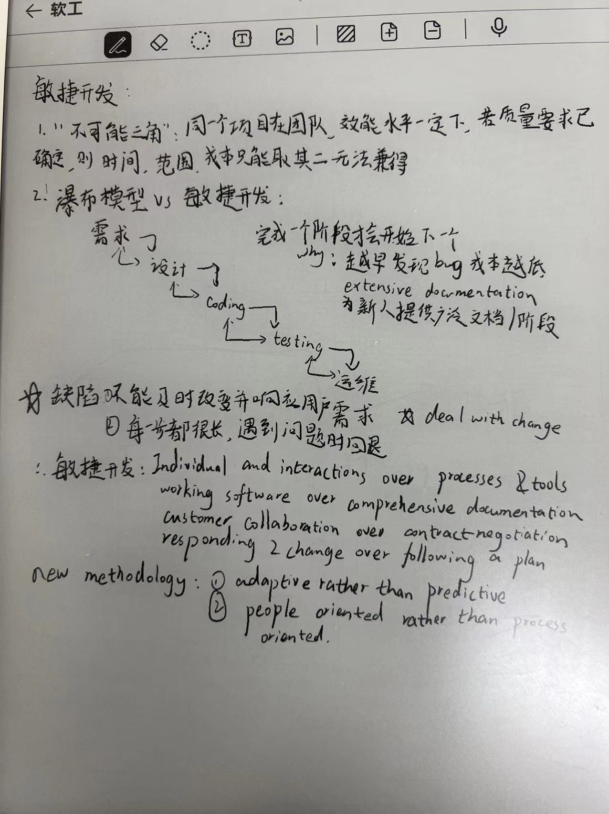
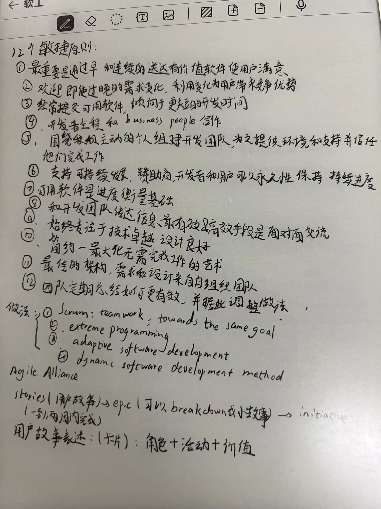
## userstory
从 INVEST(第一个 PPT 第23 页开始)，前面的在Pad 上面
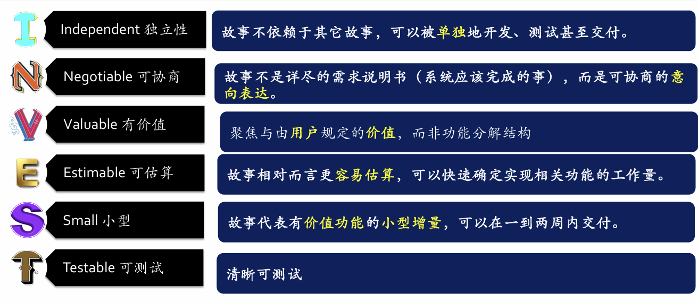

## **scheduling**: tasks vs resources
- 在一次迭代中无需担心路径依赖问题，因为有每日例会
- 滚动的提前计划：不同队伍花5分钟一起看一下之后1~3个迭代，识别队伍之间的路径依赖
- 对于一个复杂项目：
  - 首先尝试编写大部分独立的产品待办事项。如果一个项目的产品待办事项是独立的，并且可以按任意顺序开发，那么关键路径问题就会消失
  - 画一个网络流图（task network diagram）看接下来3~6个月的用户故事的关系，并且分析出关键路径
- task network diagram
  - 描述项目长度，顺序，并行性，依赖
  - 关键路径是其中最长的路径
    - 无法延迟其中的过程而不影响整体进度
    - 是加速整个项目的关键
    - 画图可形如
      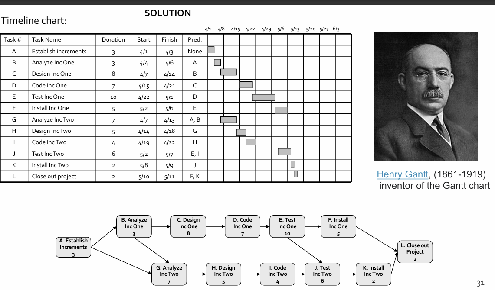

  - 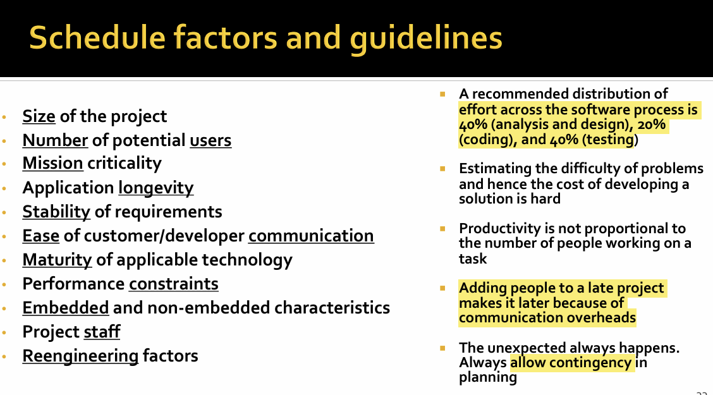

## 开发⼯具与敏捷开发概念的对应
- git vs agile programming

  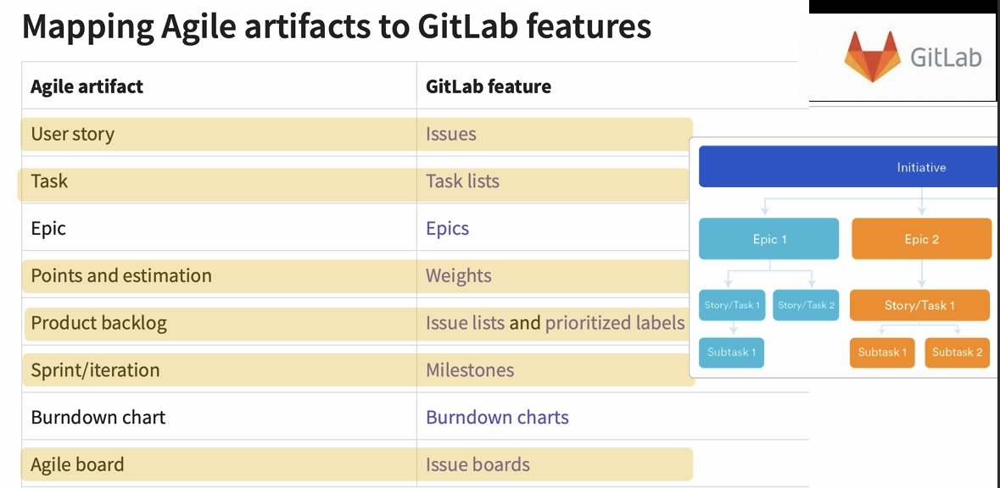
- version-revision-release(版本号)
  - A.B.C 型版本号，A 是面向用户的版本号，B 是面向开发者的版本号，C 只改正错误（面向开发者）
- git: 分布式版本管理
  - 本地工作区<->暂存区<->本地版本库<->远程（中心）版本库

## 后端-git 
- 动机：找 不同版本差异，修改者，修改时间，修改原因
- git: 分布式版本控制器
- git 基本概念：
  - 工作区：工作目录（代码所在的文件夹）
  - 暂存区：临时的缓存(打标记)
  - 分支：将暂存区的内容提交到分支
- 分支管理
  - commit: 一次提交，用独一无二的hash 表示，伴随提交信息
  - master(main): 默认主分支，其实是个指针，指向主分支最新commit
  - head: 当前位于的commit 一般是当前分支的最新commit
- git merge mode
  - FastForward
  - Three-Way Merge
  - Squash Merge
## 前后端
前端三件套：HTML(元素框架结构) CSS(元素样式) JS(如何相应用户操作)
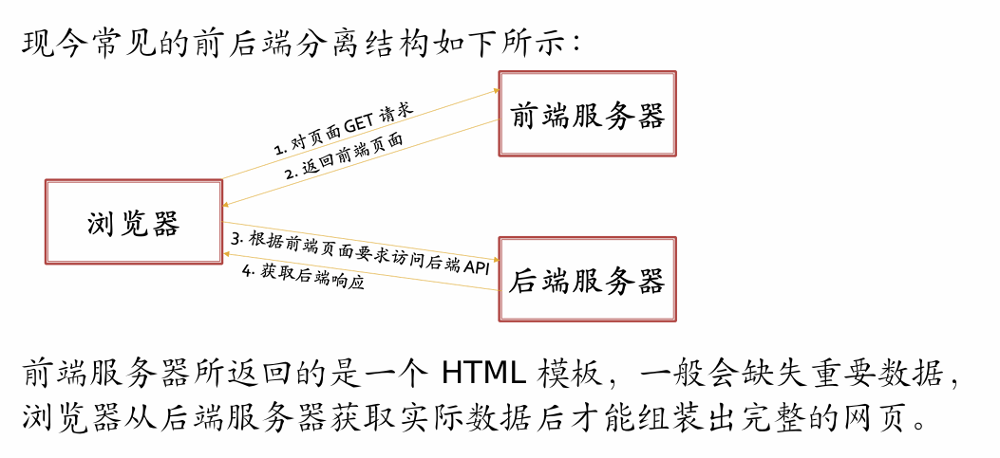

- HTTP: 请求: 请求行，请求头，请求体  应答：状态行，应答头，应答体
- 前后端之间约定API
- 安全：
  - 前端不可信任原则：
    - 现代浏览器限制所有跨域请求（CORS）
     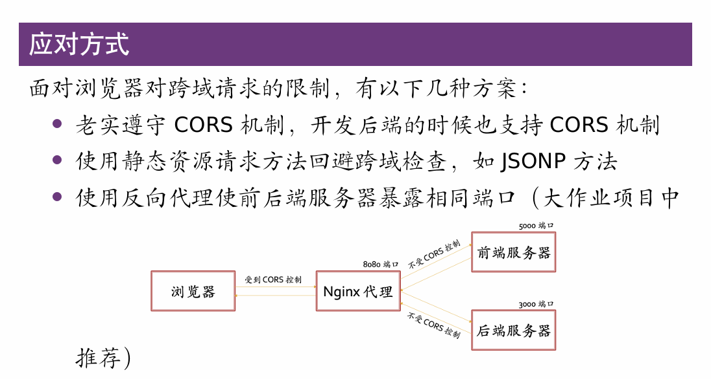
- **鉴权**：
  - JWT
    - 形如 header.payload.signature
    - header: 由令牌类型"typ"和所用加密算法“alg” 表示，比如（"alg":"HS256","typ":"JWT"）
    - payload
    - 签名：用于验证消息的发送者身份并确保消息在传输过程中未被篡改，对头部和载荷进行加密算法处理，并使用秘钥来生成
  - 使用场景：身份验证，信息交换
- 后端：
  - 数据交互
  - 持久化存储
- 作用：前端查询：后端给数据；前端修改：后端**在检查后**给响应
- 请求体：json
- 持久化存储：数据库
- ORM:
  - 基于关系型数据库
  - 一个数据表和一个实体类联系，每一列<->具体成员变量,每一行<->一个实例 数据表<-> 相同类的实体构成的集合
- 后端调试：
  - 人工：PostMan
  - 自动：单测（涉及到一般情况与尽可能多的Corner Cases），将后端逻辑视为黑盒，模拟前端请求，再通过一系列断言验证正确性
- 后端框架作用
  - 路由：将前端请求的不同路径映射到不同处理函数
  - 模型：与数据库交互方式
  - 视图：前端请求的处理函数，接受用户请求并返回响应
  - 单元测试：如何为测试工程师提供模拟请求、读写数据库、断言的操作

## 前端
### typescript
- typescript 是 javascript 的超集 提供静态类型检查，在编译时检查
- yarn/npm 是 ts 的包管理工具

  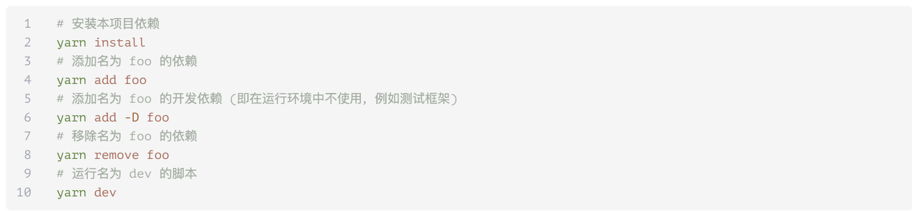
  其中 yarn 脚本在 package.json 里面的 scripts 中定义
- 常量不难被重新赋值，变量不能被赋予与其声明不同的类型值
- 由于 JavaScript 的特性，请使⽤  === 与 !== 代替 == 与 !=，因为后者会进⾏类型转换
- 接口是⼀种抽象结构，⽤于定义对象应具有的属性，类比C++ 抽象类，e.g interface Bar{a:number,t:string} const b={a:3,t:"b"} as Bar;
- python 中一些错误行为，比如数组越界访问，字典访问不存在的 key 啥的都会是undefined
- 函数箭头声明belike：const sum2 = (x : number,y : number): number => x + y;
- react 引入了tsx的语法拓展，特别是引入了标签语法（就是那个`<div></div>`）
- 大括号嵌入
- 对于`<div>`数组，需要用`<div key={2}>`这样的形式提供独一无二的 key 方便部分更新
- **函数组件** 接收参数Props 返回一个Tsx 标签 一般用CamelCase
### **状态管理**
- 用useState hook，返回值为一个元组，第一项是当前状态，第二项是改变状态用的函数
- 状态保存在组件外
- 更改状态和触发重新渲染同时进行
  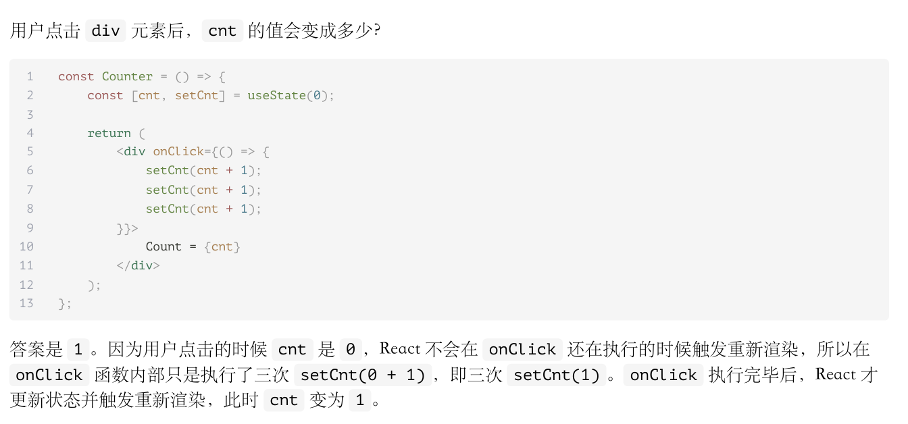
  在上述图的情况下，如果确实想要连加3次可以使用`setCnt((n) => n + 1)`的方法 同时 `setCnt(1)其实就是 setCnt((n)=>1)`
- 若组件更新后状态和更新前一致，则不进行渲染。对于数字&字符串 一致指值一致，对于数组，对象等，指的是地址一致，所以可能出现意料之外的情况
- 若与组件无关的变量，不需要其重新渲染，则可以用useRef hook,比如 const r=useRef(initvalue) 改值时 r.current=someValue
- 全局状态用redux
### nextjs 路由
- 基于文件系统的路由，路径与.tsx文件路径一致
- src/pages/_app.tsx 是入口文件，**不参与路由**。/ 对应 src/pages/index.tsx /login 对应 src/pages/login.tsx
- useRouter hook 可以 1. 捕获路由参数 2. 实现页面跳转，用 const router=useRouter(); router.push("/login");跳转，用 router.back() 返回上一页

### 副作用与网络请求
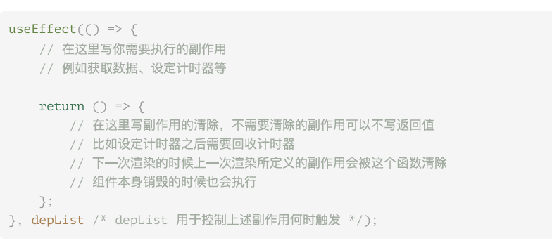
useEffect 的返回值为副作用的清除函数，逗号后面的值决定更新的时间 无论是啥都会在初始加载的时候更新  
副作用的清除函数在新的一次执行前&& 销毁组件时触发
#### 异步
await 只能在异步函数体里面使用
组件中可以用 then 链 belike `request(...).then((res)=>{ do something...}).then(()=>{do something...})`

## 软件测试
### 测试方法分类
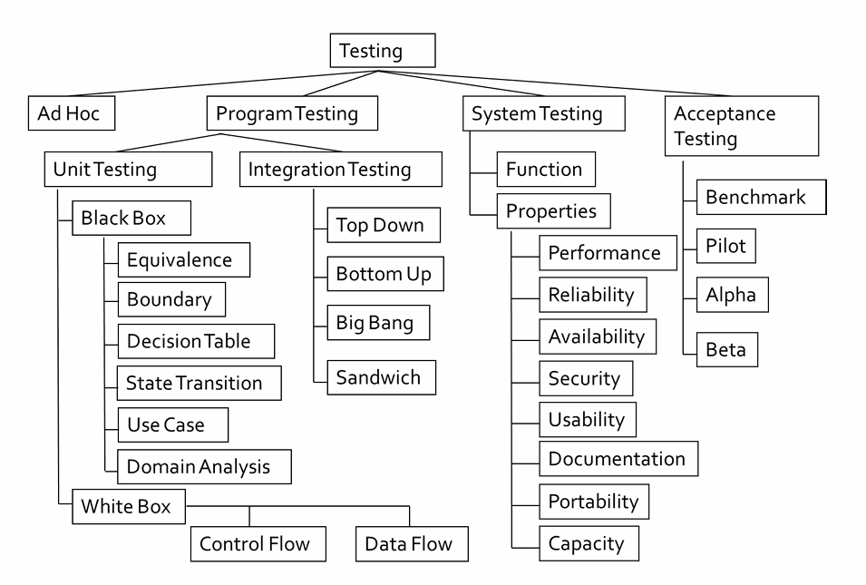
- software quality == fitness for use
- software QA department. SQ Quality assurance: verification (build the thing right) and validation (build the right thing)
- testing and formal methods: software inspection (Analyze and check system representations) and software testing (Execute the software with test data and examine the outputs) 
- 错误率恒定定律：对于一个程序猿，不考虑其能力增长，错误产出比在很长一段时间内（项目周期内）是一个常数
- 规模代价平方定律：定位并修复一个 bug 的代价正比于目标代码规模的平方
- 尽可能早的发现错误，尽可能小的范围内定位&&修复错误
- 测试驱动开发循环（TDD）：写测试-> 测试失败-> 写代码-> 测试成功 -> 重构-> 继续写测试
  - 单测通过之前，不能写生产代码
  - 写新的单测恰好让现有代码通不过为止
  - 写生产代码正好让现有单测通过即可
- TDD 和常规测试方式相比，更加高效
### 测试层次
- 测试优点
   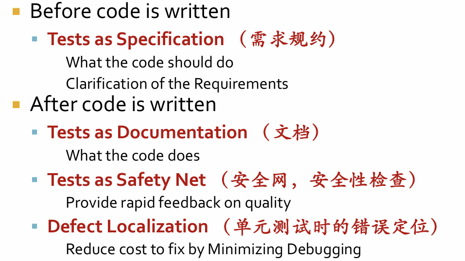

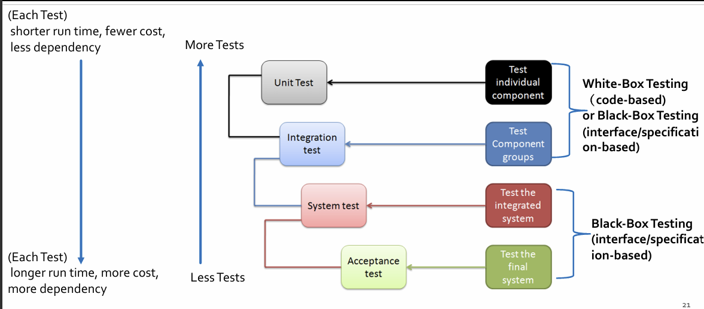
### 测试用例
- 好的 testcase 可以找到未被发现的错误
- 测试用例是一个四元偶对：输入数据，前置条件，测试步骤，预期输出
- 不可能穷尽测试（测试所有的输入）
- **coverage-based testing**
  - 白盒：control flow coverage;data flow coverage
  - 黑盒：requirement coverage

### **测试原则**
- 原则：
  - 所有测试都应有用户需求的根据
  - 测试在开始之前一段时间就应被计划好
  - 20-80 原则成立（80% 代码由20% 人写，80% 错误出现由 20% 人犯，存在在 20% 的代码中）
  - 测试应该从‘小处’开始，然后逐步扩展到‘大处’进行
  - 不能期望遍历测试（aka 把所有 testcase 序列全测完）
- FIRST:
  - F: fast 要求测 (测试集的子集) 的很快，因为时不时就要测试
  - I: Independent 测试集之间解耦，可以以任何顺序跑测试子集
  - R: Repeatable 每次测试结果保持一致
  - S: self-checking  测试可以自动判断是否通过
  - T: timely 和被测代码几乎同时完成
- 黑盒测试
  - 只知道产品的具体功能
  - 按照接口进行测试
  - 基于规则的覆盖率
- 白盒测试
  - 知道产品内部构造
  - 按照代码测试
  - 基于代码的覆盖率
  - 控制流测试
    - 语句覆盖
      - 所有语句都要覆盖到
        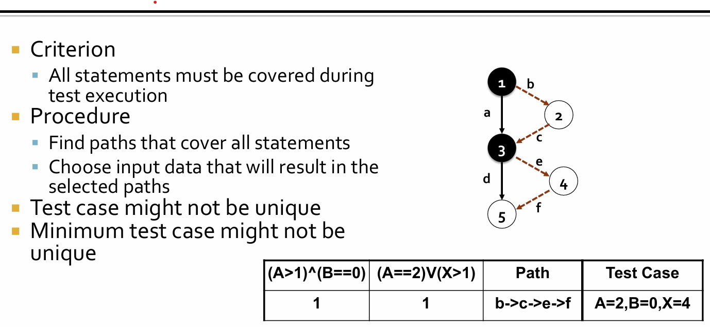
    - 判定覆盖
      - 分支取值 true false 都要覆盖到
        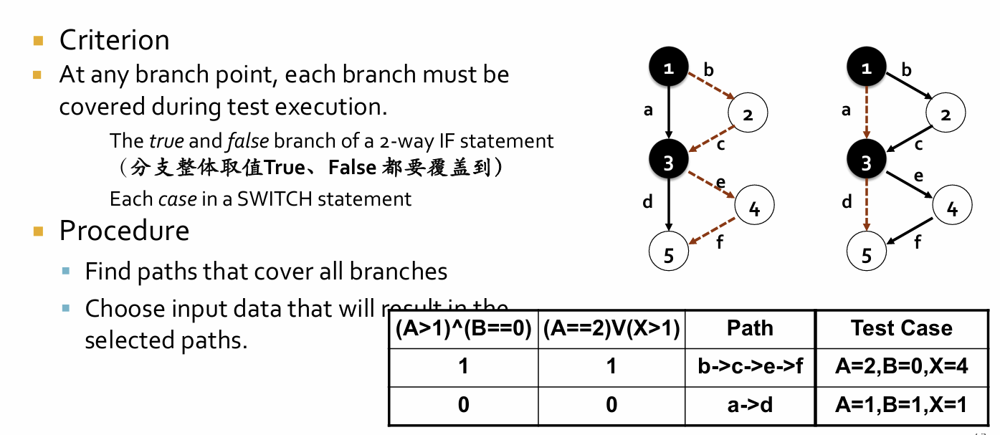 
    - 条件覆盖
      - 每个条件的true false 都要覆盖到。但是允许有短路判断的情况 比如 A&&B 可能测 A==1 B==0; A==0 B==1
    - Multiple condition coverage
    - all path coverage: 实际过程中不太实用
- 黑盒测试
  - 等价类测试
    - 把不可穷举的数据变成可以穷举的等价类，测例从每个等价类产生
    - EP testing
      - weak testing: 覆盖所有 input 类型，但是不覆盖所有 input 组合
      - strong testing: 覆盖所有 input 类型和组合
      - general testing: 覆盖 valid input
      - robust testing: 覆盖 invalid 和 valid input
  - 边界值分析
    - 测试类的边界值
    - 也从 output 中提取 testcases
### xUnit
- a family of unit testing frameworks for automating programmer tests

  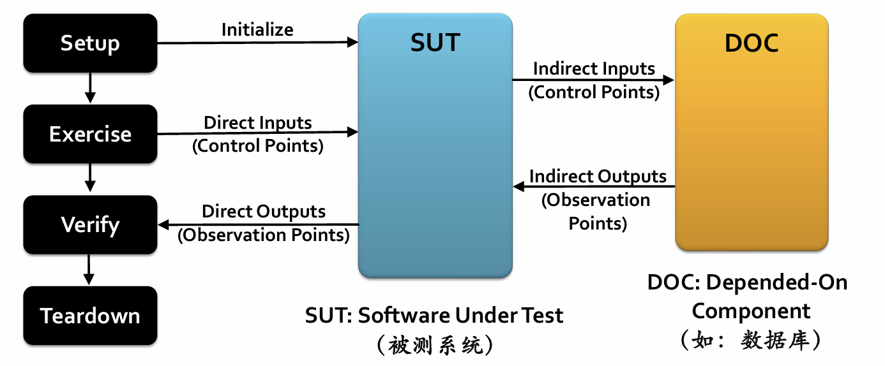

### 测试装置
- 我们需要使用 Software Unit Tests 的所有需要条件，如加载数据库，清理硬盘，拷贝文件准备输入这些（看xunit 的setup）
- 跑完每一轮后 测试装置都要被拆了重建迎接下一轮

### intergration testing
- 即使在单独测试接口没啥问题的情况下，组合不同接口测试也可能会出现问题
- the "Big Bang": 直接把所有 components 组合测试，出现问题时不易锁定
- 增量融合
  - 以小增量的形式构建并且测试
  - 功能分解：top down, bottom up, sandwich
  - top down: 从最高级的组件出发，随着控制的顺序不断往下，可以按照深度优先/宽度优先两种层次
    - 测试桩：代表子分支程序的接口
    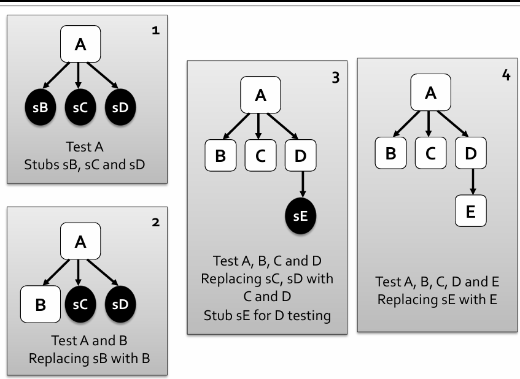
    - 优势：很早验证主要的控制流/决定，可以更早发现大问题；劣势：写 stub 很难，需要大量 stub， 有些接口没有单独测试
  - bottom up: 自底向上融合
    - 测试驱动：测试和协调测例的 input 和 output
    - 优势：不需要stubs，测试完备， 对于实时系统/有严格性能要求的系统适用
    - 劣势：很晚才测试控制逻辑和重要子系统，需要驱动

### system testing
- performance testing: 影响系统性能：硬件，运行软件的平台，应用，第三方API
  - Load Testing: 期望负载下系统行为
  - stress testing: 压力测试，capacity 的上限，在超高负载下的鲁棒性
  - soak testing: 能否经受很久期望负载
  - spike testing: 突然增大负载，观察系统行为
  - configuration testing： 改变配置时系统行为和做法
- 混沌工程
- acceptance testing
  - User Acceptance Testing: 证明用户接收我们提供的程序
    - alpha: 识别并测试一个正常用户可能做的操作，是被开发内部人员做的
    - beta: 被相关专家做，并在试用或审查后提供发现摘要以确认是否继续
- continuous intergration 即 CI
- benchmarking
  - 测试相对性能
- Smoke Testing
  - 测试**最重要功能**，判断如果系统非常差就不继续测了
- Regression Testing
  - 新系统可以在现有测试上跑起来。high prior: 重要的，比较用户暴露的，修改多的，容易有异常的 medium prior：之前被（多次）报错过的样例
- Fuzzing
- Canary Testing
  - 在全面更新之前，先对一小部分人进行逐渐更新
- A/B testing
  - 只有一个组件有区别的 A/B 版本向用户展示

## 代码风格和重构
- **这部分的好处 有些小项的好处是一样的 就按照自己理解答题就行**
### **防御式编程**
- "Assume Nothing"，尽可能详细测试，e.g 外来数据，输入参数，处理非法输入
- 优势：
  - debug 方便
  - 一直正常工作的 working code 强于大部分时候正常偶尔崩掉的代码
- 缺点：
  - 性能减弱
  - 额外人力开销
- 错误处理方法：返回错误码，专门搞个 routine 来错误处理，错误信息输出，shutdown (参考 windows 上的 BSOD)
  - 在需要正常运行时错误处理：返回平凡值，下一个合法值，最近的合法值，上一次结果，记录警告信息

### **代码格式（presentation）**
- write for other programmer's benefit
- 在函数内，把代码按照内部逻辑用空行分隔成代码块
- 好代码不需要花很久理解，一定是清晰明确的
- **格式**（presentation）:
  - 重要性：
    - 非常影响代码质量
    - 程序员按照 layout 读代码，格式展示代码 layout 和结构，帮助别人看懂
    - 不好的格式还可能会隐藏错误
  - 好格式：
    - 一致性：整个项目保持一致
    - 常规的：和自己发明 style 相比，更好是用现有 style
    - 简洁清晰：容易被其他人沿用
  - 通用代码标准
    - Indian Hill(AT&T 贝尔实验室)
    - GNU
    - MISRA(英国)
### **命名规范**
- 需求：准确易懂
- 重要性：
  - 人类惯常通过名字理解语义
  - 一个名字描述：身份（identity）（比如是描述啥的），行为（作用,关系，交互），认识（由概念到实体）
- 如何命名：
  - 描述性的
  - 技术上正确（比如能否使用空格，能否使用 Unicode 这样）
  - 符合语言习惯
  - 准确：在清晰和简洁中，选择清晰；不用口语化的 Foo,Bar 这些命名
  - 不能：
    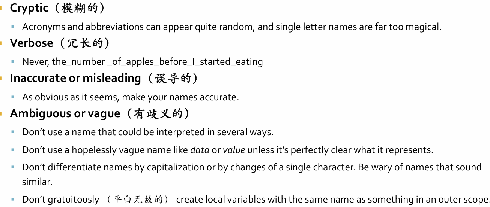
  - 变量命名规范
    - 从snake_case,camelCase,kebab-case 这些选一个一直用
### 自文档化代码
- 原理：
  - 能完备且准确描述你代码的东西只有你的代码
  - 让你的代码容易被人类读懂（compilers will be able to cope）（即使是最小最美的函数也会涉及之后运维）
- 方法：
  - 用好的形式写简单的代码
    - 让你代码中的正确路径明显
      - 比如 if-elif-else 永远把正常路径放在错误路径前面或者反之
      - 避免太多嵌套语句，在单入单出的出口点和嵌套层次之间 tradeoff
      - 小心优化代码使得它不再是一个简单算法的基本表现形式
        - 除非证明这个算法是瓶颈，否则不做优化
      - "goto statement considered harmful"
  - 函数原子化
    - 减少函数副作用，一个函数只做一件事，而且尽可能简单化
  - 归类相关信息
    - 用语言特性显示归类相关信息（比如可以用 enum 存错误码）
  - 突出重点代码，而且使之更可读
  - 选择有意义的名字和描述性的类型
  - 常数命名，而非魔数到处使用

### 注释
- focus on quality not quantity. Write enough comments and no more. 只写几条 good comments,和写一堆 comments相比，提升代码质量更重要
- 做法
  - 解释“为什么”，而非“怎么”
  - 不要描述代码
  - 不要取代代码
  - 有用的：
    - 记录意料之外的行为
    - 符合事实
    - 是清晰且有价值的
  - 易于维护的 style:  belike
     ```c
        /****************************
        aaa bbb blahblahblah
        ****************************/
     ```

### code smells
- 表层现象指示系统中的深层问题，暗示你代码某处可能出现问题了
- **他们不是bug,技术上是正确的，不影响现有程序运作，只是一些指示设计上缺陷的症状(是 warning signs)** (有点类似于开发规范问题)
- 像是 SonarQube 检查代码质量，如重复代码，代码标准，复杂度，comments,bugs
- 一些不好的smell: 重复代码，大函数，大类，长参数，并列的继承关系，多个类过度耦合，不同接口的替代类等
- ABC complexity: count A:Assignments,B: Branches: function calls C: conditions 像 <,>, else,case 这些，score=squareroot(A^2+B^2+C^2)，NIST要求对于每个方法 这个值<=20
- 圈复杂度
  比较方便就是直接数区域数，每一个节点表示非平凡的语句，像是 if(condition)，而do,else 这种不算，期望这个值<=10
  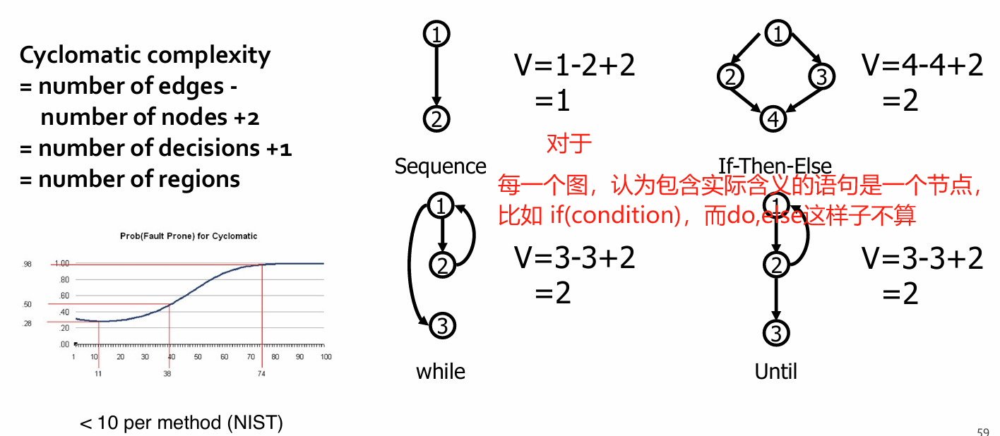 
- 圈复杂度，ABC 复杂度更适用于发现 hotspots 并且优化
### 代码重构
- 定义： 重构是一个 disciplined 技术，用于重组现有代码库，改变其内部结构而不改变外部行为
- 用于增强一些非功能性质量：简单，灵活，可理解，性能
- 核心是一系列保持行为的小规模转变，每次转变后，系统保持完全正常运行。比如说在有 code smell 的时候重构
### 设计模式
- 促进代码复用
- SOLID 原则：
  - Single Responsibility principle（单一职责原则）
    - 一个类只能由单一原因引起改变，*defining responsibilities and sticking to them*
    - LCOM4: 对于一个类的方法，如果彼此有依赖关系就连边，最终看独立子图个数（==LCOM4），如果独立子图大于1个则这个类可以再拆开
  - Open/Closed 原则：对扩展开发，对修改封闭
  - 里氏替换原则：所有引用基类的地方都可以透明使用子类对象
  - I: 接口隔离原则：客户端不应该依赖不需要的接口，类之间的依赖关系应该建立在最小的接口上
    - 表现：A class 依赖 B class 的话，如果不改变 A 的接口就无法扩展 B 的能力
    - refa: 
      - 插入一个对A都一样的接口，但是适配不同B
      - 抽象类
  - D: Demeter principle: ⼀个实体应当尽量少地与其他实体之间发⽣相互作用，使得系统功能模块相对独立
    - 表现：长链
    - refa: visitor/observer pattern
